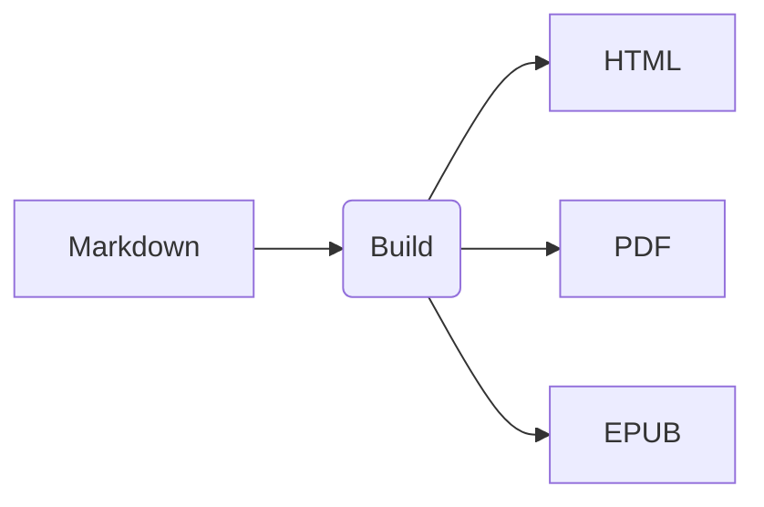

# Hermes-Skill-Content-Pipeline (内容发布流水线)

## 概述

**Hermes-Skill-Content-Pipeline** 是一套专业的内容生产与发布自动化系统。它将写作、排版、审核、多格式转换、多平台分发全流程管道化，让创作者专注于内容本身而非发布琐事。

### 核心能力

- **源格式统一**: Markdown 为单一真相来源 (Single Source of Truth)
- **多格式输出**: HTML / PDF / EPUB / MOBI / DOCX / Newsletter / Social Cards
- **多平台分发**: GitHub Pages / Vercel / Medium / Substack / 微信公众号 / 知乎
- **自动化流水线**: Git push → Build → Preview → Deploy → Notify
- **版本管理**: 内容版本控制 + 变更追踪 + 回滚
- **SEO 就绪**: 自动生成 meta tags / sitemap / RSS / Open Graph

---

## 流水线架构

```
┌────────────────────────────────────────────────────────────┐
│                    CONTENT PIPELINE                          │
│                                                              │
│  ┌──────────┐   ┌──────────┐   ┌──────────┐   ┌──────────┐ │
│  │  Write   │ → │  Review  │ → │  Build   │ → │ Deploy   │ │
│  │ Markdown │   │  & Approve│   │ Multi-Fmt│   │ Multi-Ch │ │
│  └──────────┘   └──────────┘   └──────────┘   └──────────┘ │
│       ↑                              │               │     │
│       │                              ▼               ▼     │
│  ┌──────────┐   ┌──────────────────────────────────────┐   │
│  │  Plan    │   │            OUTPUT FORMATS             │   │
│  │ Calendar │   │  HTML Site │ PDF │ EPUB │ Newsletter │   │
│  └──────────┘   │  Social Card│ Slide │ Audio │ API JSON│   │
│                  └──────────────────────────────────────┘   │
│                                                              │
│  ┌──────────────────────────────────────────────────────┐   │
│  │              DISTRIBUTION CHANNELS                     │   │
│  │  Web (Vercel/GH Pages) │ Email (Substack/ConvertKit)  │   │
│  │  Ebook (Amazon KDP)     │ Social (Twitter/LinkedIn)    │   │
│  │  CN Platform (公众号/知乎) │ Docs (GitBook/Notion)      │   │
│  └──────────────────────────────────────────────────────┘   │
└────────────────────────────────────────────────────────────┘
```

---

## 快速开始

```bash
# 初始化内容项目
/pipeline init --name my-blog --template tech-blog --targets web,pdf,newsletter

# 创建新文章
/pipeline new post --title "Understanding Hermes Skills" --category tutorial --tags ai,agent

# 本地预览
/pipeline preview --port 3000

# 构建所有格式
/pipeline build --all

# 发布到所有平台
/pipeline deploy --all

# 发布单个平台
/pipeline deploy --target web --env production
```

---

## Markdown 扩展语法

### 支持的高级特性

```
基础 Markdown + 扩展:

✅ 标准语法:
├── 标题 (H1-H6)
├── 粗体/斜体/删除线
├── 有序/无序列表
├── 代码块 (语法高亮)
├── 表格
├── 链接和图片
├── 引用块
└── 分隔线

🔧 Front Matter (YAML):
---
title: "My Article"
date: 2026-04-27
author: carycoooper
tags: [ai, hermes, skills]
category: tutorial
image: cover.jpg
excerpt: "A comprehensive guide..."
draft: false
seo:
  description: "Learn how..."
  keywords: "AI agent, skills"
  canonical: https://mysite.com/article
publish_to:
  - web
  - newsletter
  - wechat
---

🎨 UI 组件 (自定义语法):
:::info
这是一个信息提示框
:::

:::warning⚠️ 这是警告提示
:::

:::tip💡 这是一个技巧提示
:::

🖼️ 图片增强:
{width=60% #fig:diagram}
*Figure 1: System Architecture*

📊 图表嵌入:


📹 视频/音频:



🔗 Call-to-Action:


📝 代码交互:

```

---

## 多格式输出配置

### HTML 网站 (Static Site Generator)

```yaml
# pipeline.config.yaml
site:
  name: "Hermes Skills Blog"
  url: "https://blog.hermes.ai"
  description: "The definitive resource for Hermes Agent skills"
  
  theme:
    name: "professional-dark"
    colors:
      primary: "#6366f1"
      accent: "#f59e0b"
    fonts:
      heading: "Inter"
      body: "Inter"
      
  structure:
    homepage:
      layout: featured-posts-grid
      posts_per_page: 12
      show_categories: true
      
    post:
      layout: article-with-toc
      toc_depth: 3
      show_reading_time: true
      show_author: true
      show_date: true
      show_tags: true
      show_related_posts: 3
      comments: giscus  # or disqus, utterances
      prev_next_navigation: true
      
    pages:
      about: "/about"
      archive: "/archive"
      tags: "/tags"
      
  features:
    search:
      provider: pagefind  # or algolia, flexsearch
      instant: true
      
    rss:
      enabled: true
      full_content: false
      
    sitemap:
      enabled: true
      changefreq: weekly
      priority: 1.0
      
    seo:
      og_image: /default-og-image.png
      twitter_card: summary_large_image
      
    analytics:
      google: G-XXXXXXXXXX
      plausible: plausible.example.com
      
    i18n:
      default_lang: zh-CN
      available: [zh-CN, en]
```

### PDF 电子书

```yaml
pdf:
  format: A4
  margins:
    top: 25mm
    bottom: 25mm
    left: 20mm
    right: 20mm
    
  styling:
    font_family: "Source Han Serif SC"  # 中文衬线
    font_size: 11pt
    line_height: 1.6
    paragraph_indent: 2em
    
  page_numbers: true
  headers:
    show_title: true
    show_chapter_name: true
    show_page_number: true
    
  toc:
    depth: 3
    include_in_output: true
    
  covers:
    front_cover: assets/covers/front.pdf
    back_cover: assets/covers/back.pdf
    
  output: "hermes-skills-guide-v2.0.pdf"
```

### EPUB/MOBI 电子书

```yaml
ebook:
  title: "Hermes Skills Complete Guide"
  author: "carycoooper"
  language: zh-CN
  identifier: "urn:uuid:550e8400-e29b-41d4-a716-446655440000"
  
  chapters:
    - file: introduction.md
      title: "Introduction"
    - file: getting-started.md
      title: "Getting Started"
    - part: "Core Skills"
      chapters:
        - file: deep-research.md
        - file: self-improving-agent.md
        ...
        
  stylesheet: assets/ebook-styles.css
  images: assets/ebook-images/
  
  outputs:
    epub: "hermes-skills-guide.epub"
    mobi: "hermes-skills-guide.mobi"
```

### Newsletter (Email)

```yaml
newsletter:
  platform: convertkit  # or mailchimp, substack, buttondown
  
  template: modern-newsletter
  branding:
    header_image: assets/newsletter-header.png
    primary_color: "#6366f1"
    footer_text: "© 2026 Hermes Skills. Unsubscribe {{unsubscribe_url}}"
    
  sections:
    - type: hero
      content: "{{post_title}}"
      image: "{{post_image}}"
      
    - type: body
      content: "{{post_excerpt}}... [Read Full Article]({{post_url}})"
      
    - type: divider
      
    - type: sidebar
      items:
        - label: "Latest Posts"
          type: recent_posts
          count: 3
          
    - type: cta
      text: "Enjoyed this? Share with a friend!"
      buttons:
        - text: "Share on Twitter"
          url: "https://twitter.com/intent/tweet?url={{post_url}}"
          
    - type: footer
      social_links: true
      unsubscribe: true
      
  scheduling:
    send_time: "Tuesday 09:00 Asia/Shanghai"
    timezone: "Asia/Shanghai"
```

---

## CI/CD 自动化

### GitHub Actions 配置

```yaml
# .github/workflows/content-pipeline.yml
name: Content Pipeline

on:
  push:
    branches: [main]
    paths:
      - 'content/**'
      - 'assets/**'
  workflow_dispatch:  # 手动触发

jobs:
  preview:
    name: Preview Build
    runs-on: ubuntu-latest
    steps:
      - uses: actions/checkout@v4
      
      - name: Setup Node.js
        uses: actions/setup-node@v4
        with:
          node-version: 20
          cache: npm
          
      - name: Install dependencies
        run: npm ci
        
      - name: Build Preview
        run: npm run build:preview
        
      - name: Upload Preview Artifact
        uses: actions/upload-artifact@v4
        with:
          name: preview-site
          path: dist/
          
  deploy-production:
    name: Deploy to Production
    needs: preview
    if: github.ref == 'refs/heads/main'
    runs-on: ubuntu-latest
    environment: production
    steps:
      - uses: actions/checkout@v4
      
      - name: Build All Formats
        run: |
          npm run build:web
          npm run build:pdf
          npm run build:ebook
          npm run build:newsletter
          
      - name: Deploy to Vercel
        uses: amondnet/vercel-action@v25
        with:
          vercel-token: ${{ secrets.VERCEL_TOKEN }}
          vercel-org-id: ${{ secrets.VERCEL_ORG_ID }}
          vercel-project-id: ${{ secrets.VERCEL_PROJECT_ID }}
          vercel-args: '--prod'
          
      - name: Upload PDF Release
        uses: softprops/action-gh-release@v2
        with:
          files: dist/pdf/*.pdf
          tag_name: v${{ github.run_number }}
          
      - name: Send Notification
        if: success()
        run: |
          curl -X POST "${{ secrets.SLACK_WEBHOOK }}" \
            -H 'Content-type: application/json' \
            --data '{"text":"🚀 New content deployed! ${{ github.event.head_commit.message }}"}'
            
  deploy-staging:
    name: Deploy to Staging
    needs: preview
    if: github.ref != 'refs/heads/main'
    runs-on: ubuntu-latest
    environment: staging
    steps:
      - uses: actions/checkout@v4
      - name: Deploy Preview to Vercel
        uses: amondnet/vercel-action@v25
        with:
          vercel-token: ${{ secrets.VERCEL_TOKEN }}
          vercel-org-id: ${{ secrets.VERCEL_ORG_ID }}
          vercel-project-id: ${{ secrets.VERCEL_PROJECT_ID }}
```

---

## 版本管理

### 内容版本控制

```
版本策略:
├── Semantic Versioning for Content
│   ├── MAJOR: 重大改版/重构
│   ├── MINOR: 新增章节/功能
│   └── PATCH: 错别字修正/小幅更新
│
├── Change Log 自动生成
│   ├── 每次 git commit 自动记录变更
│   ├── 支持 --since / --until 时间范围筛选
│   └── 输出为 Markdown 或 HTML
│
├── 内容回滚
│   ├── git revert 特定 commit
│   ├── 或恢复到某个 tag
│   └── Preview 环境验证后再正式回滚
│
└── 多语言版本管理
    ├── i18n 目录结构
    ├── 翻译缺失检测
    └── 语言切换导航
```

---

*创新技能 - 结合 Hugo/11ty/VitePress 最佳实践 + 现代内容运营工作流*
*版本: 2.0.0 | 最后更新: 2026-04-27*
